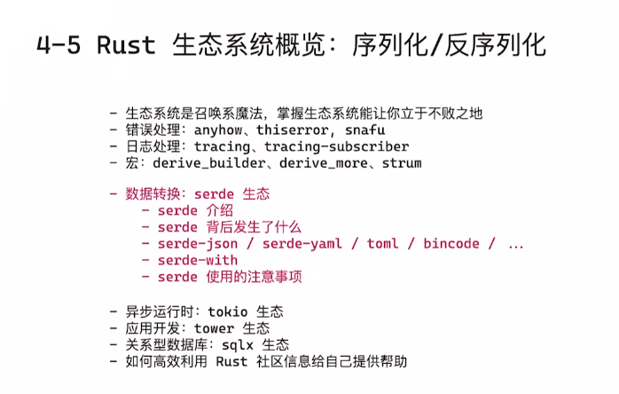
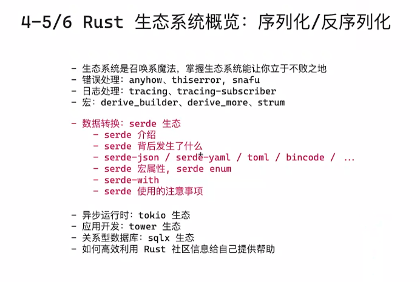
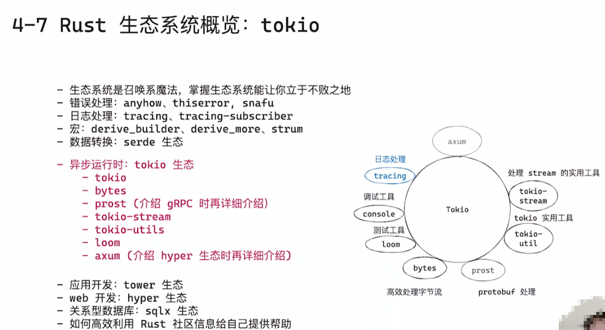
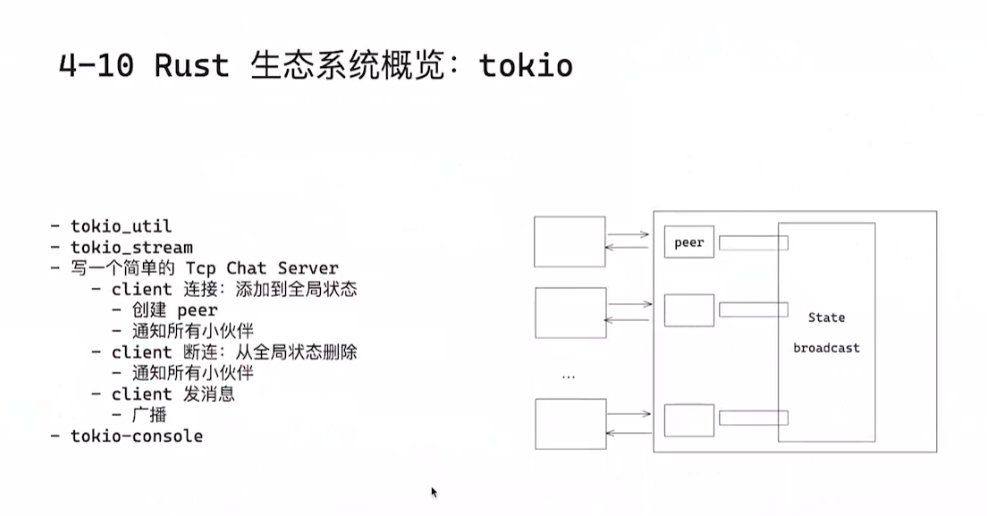
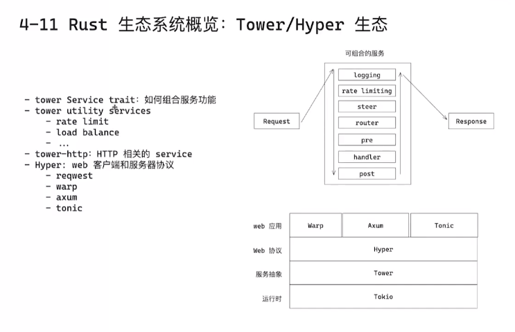
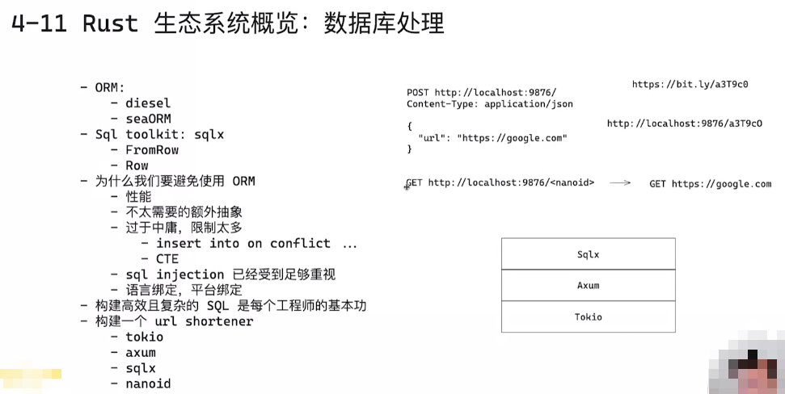
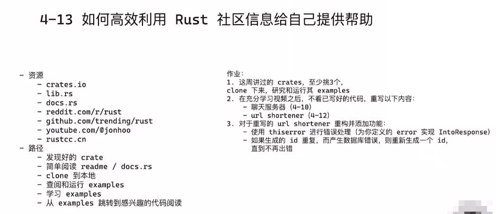

# Geektime Rust 语言训练营

## 第四周: Rust 生态系统














> 注:
>
> ```rust
> async fn shorten(
>     State(state): State<AppState>,
>     Json(data): Json<ShortenReq>,
> ) -> Result<Json<ShortenRes>, StatusCode> {
>     todo!()
> }
> ```
>
> 如果在axum的handler中需要访问http body中的内容, 请将其放在最后, 否则会报错


